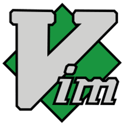

# TD Lecture Resources Repository.

***
## [Python](python/index.md)

***
## [Houdini](houdini/index.md)

***
## [OpenUSD](openusd/index.md)

***
## [Linux](linux/index.md)

***
## [Docker](docker/index.md)

***
## [Git](git/index.md)

***
## [Vim](vim/index.md)

