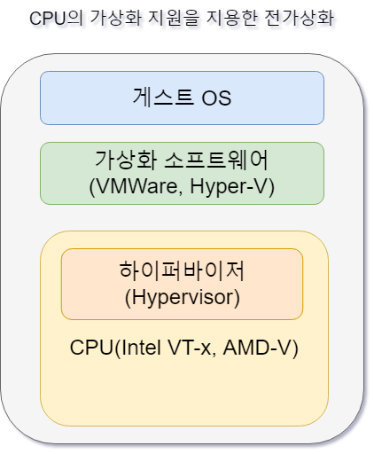
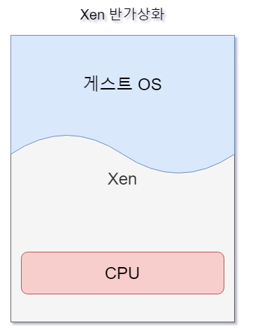
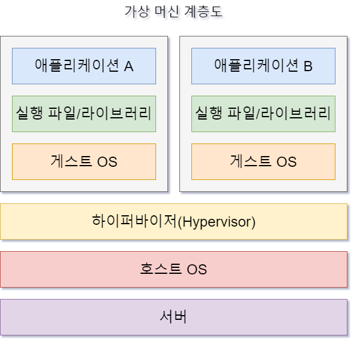
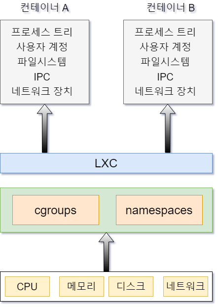
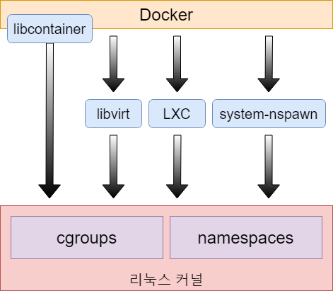
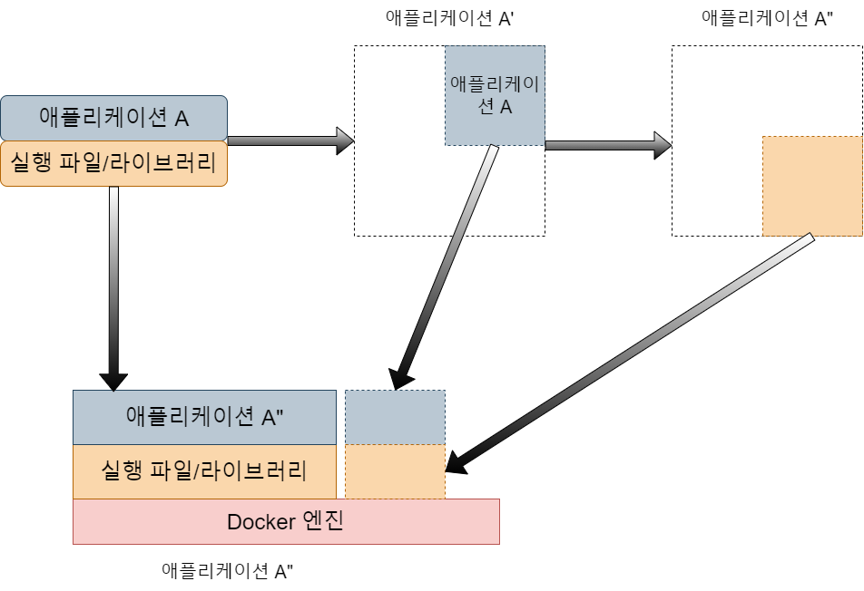

# 01-2. 가상 머신과 Docker

Docker는 지금까지 사용해왔던 VMware, Microsoft Hyper-V(Virtual PC), Xen, 리눅스 KVM 등의 가상 머신과 비슷하다.가상 머신에 리눅스를 
설치한 뒤 각종 서버 프로그램과 DB를 설치하고, 개발한 애플리케이션이나 웹사이트를 실행했다. 이렇게 구축한 가상 머신 이미지를 여러 서버에 복사해서 
실행하면 이미지 하나로 서버를 계속 만들어낼 수 있었다.   
보통 가상 머신 서버를 독자적으로 운영하거나, 서비스 형태로 제공되는 Amazon Web Services, Microsoft Azure, Google Cloud Platform을 사용하기도 한다.

## 가상 머신

가상 머신은 편하긴 하지만 성능이 좋지 못한 것이 단점이다. 지금까지 CPU에 가상화를 위한 기능들이 많이 추가되었지만 아직도 가상 머신은 리얼 머신에 비해 속도가 느리다.

전가상화(Full Virtualization)의 느린 속도를 개선하기 위해 반가상화(Paravirtualization) 방식이 개발되었고, 현재 널리 쓰이고 있다.

위의 그림과 같이 가상 머신 자체는 완전한 컴퓨터라 항상 게스트 OS를 설치해야 한다. 그래서 이미지 안에 OS가 포함되기 때문에 이미지 용량이 커진다.

아무리 네트워크와 인터넷 속도가 빨라졌다 하더라도 가상화 이미지를 주고받는 것은 꽤 부담스럽다. 특히 오픈 소스 가상화 소프트웨어는 OS를 가상화하는 
것에만 초점이 맞춰져 있다. 그래서 이미지를 생성하고 실행하는 기능만 있을 뿐 배포와 관리 기능이 부족하다.

> 가상 머신 배포
> > 가상 머신을 중앙에서 관리하고 배포하는 상용 제품은 VMware vCenter, Microsoft System Center가 있다.

## Docker

Docker는 반가상화보다 좀 더 경량화된 방식이다. 위의 그림처럼 게스트 OS를 설치하지 않는다. Docker 이미지에 서버 운영을 위한 프로그램과 
라이브러리만 격리해서 설치할 수 있고, OS 자원(시스템 콜)은 호스트와 공유한다. 이렇게 되면서 이미지 용량이 크게 줄어들었다.

Docker는 하드웨어를 가상화하는 계층이 없기 때문에 메모리 접근, 파일 시스템, 네트워크 속도가 가상 머신에 비해 월등히 빠르다.

아래의 표는 Docker 1.1.2에서 우분투 14.04 호스트와 우분투 14.04 Docker 컨테이너의 성능을 측정한 결과이다. 수치상으로 호스트와 Docker 
컨테이너 사이의 성능 차이는 크지 않다. 호스트와 거의 동일한 속도라 할 수 있다.

|         | 성능 측정 도구 | 호스트 | Docker |
|:-------:|:--------:|:---:|:------:|
|   CPU   | sysbench | 1 | 0.9945 |
| 메모리 쓰기  | sysbench | 1 | 0.9826 |
| 메모리 읽기  | sysbench | 1 | 1.0025 |
| 디스크 I/O |    dd    | 1 | 0.9811 |
|  네트워크   |  iperf   | 1 | 0.9626 |

Docker는 가상 머신과는 달리 이미지 생성과 배포에 특화된 기능을 제공한다. Git에서 소스를 관리하는 것처럼 이미지 버전 관리 기능을 제공한다. 또한, 
중앙 관리를 위해 저장소에 이미지를 올리고, 받을 수 있다(Push/Pull). 그리고 GitHub처럼 Docker 이미지를 공유할 수 있는 Docker Hub도 
제공한다(GitHub처럼 유료 개인 저장소도 제공).

다양한 API를 제공하기 때문에 원하는 만큼 자동화를 할 수 있어 개발과 서버 운영에 매우 유용하다.

## 리눅스 컨테이너

오래 전부터 리눅스/유닉스 환경은 chroot라는 명령을 제공했다. chroot는 파일시스템에서 루트 디렉토리(/)를 변경하는 명령이다. chroot로 특정 디렉토리를 
루트 디렉토리로 설정하면 chroot jail(감옥)이라는 환경이 생성되는데, chroot jail 안에서는 바깥의 파일과 디렉토리에 접근할 수 없다. 이처럼 chroot는 
디렉토리 경로를 격리하기 때문에 서버 정보 유출과 피해를 최소화하는데 주로 사용되었다.

chroot는 chroot jail에 들어갈 실행 파일과 공유 라이브러리를 직접 준비해야 하고 설정 방법이 복잡하다. 또한, 완변한 가상 환경이 아니기 때문에 
각종 제약이 많다. 이후 리눅스는 LXC(LinuX Container)라는 시스템 레벨 가상화를 제공했다.

LXC는 컴퓨터를 통째로 가상화하여 OS를 실행하는 것이 아닌 리눅스 커널 레벨에서 제공하는 일종의 격리(Isolate)된 가상 공간이다. 이 가상 공간에는 OS가 
설치되지 않기 때문에 가상 머신이라 하지 않고, 컨테이너라 부른다.

리눅스 커널의 Control Groups(cgroups)는 CPU, 메모리, 디스크, 네트워크 자원을 할당하여 완전한 형태의 가상 공간을 제공한다. 또한, 프로세스 트리, 
사용자 계정, 파일 시스템, IPC 등을 격리시켜 호스트와 별개의 공간을 만든다. 이것을 Namespace isolation(namespaces) 이라고 한다.

LXC는 리눅스 커널의 cgroups와 namespaces 기능을 활용하여 가상 공간을 제공한다.

LXC는 격리된 공간만 제공할 뿐 개발 및 서버 운영에 필요한 부가 기능이 부족했다. Docker는 리눅스 커널의 cgroups와 namespaces를 기반으로 하여 이미지, 
컨테이너 생성 및 관리 기능과 다양한 부가 기능을 제공한다.

Docker가 처음 개발될 당시에는 LXC를 기반으로 구현을 하였지만 버전 0.9부터는 LXC를 대신하는 libcontainer를 개발하여 사용하고 있다. 내부적으로는 
실행 드라이버(exec driver)라고 하는데 libcontainer는 native, LXC는 lxc로 표시된다. 실행 옵션에 따라 libcontainer를 사용하지 않고 lxc를 사용할 수도 있다.

## Docker 이미지와 컨테이너

Docker는 이미지와 컨테이너라는 개념이 있다. 먼저 베이스 이미지가 있는데, 리눅스 배포판의 유저랜드만 설치된 파일을 뜻한다. 보통 리눅스 배포판 이름으로 되어 있다. 
또는, 리눅스 배포판 유저랜드에 Redis나 Nginx등이 설치된 베이스 이미지도 있다.   
그래서 Docker 이미지라고 하면 베이스 이미지에 필요한 프로그램과 라이브러리, 소스를 설치한 뒤 파일 하나로 만든 것을 말한다.

각 리눅스 배포판 이름으로 된 베이스 이미지는 배포판 특유의 패키징 시스템을 이용할 수 있다. 원한다면 베이스 이미지를 직접 만들 수도 있다.
매번 베이스 이미지에 필요한 프로그램과 라이브러리, 소스를 설치하면 용량이 큰 이미지가 중복되어 생성될 것이라고 생각하기 쉽다. Docker 이미지는 베이스 
이미지에서 바뀐 부분만 이미지로 생성하고, 실행할 때는 베이스 이미지와 바뀐 부분을 합쳐서 실행한다.

> 유저랜드
> > OS는 메모리 사용을 기준으로 커널 공간과 유저 공간으로 나눌 수 있다. 여기서 유저 공간에서 실행되는 실행 파일과 라이브러리를 유저랜드(userland)라고 한다. 
리눅스는 커널만으로 부팅할 수 없으므로 부팅에 필요한 최소 실행 파일과 라이브러리 조합을 뜻하기도 한다. 보통 리눅스 배포판에서 유저랜드는 부팅에 필요한 
실행 파일과 라이브러리 그리고 고유의 패키징 시스템을 포함한다.

Docker 이미지는 16진수로 된 ID로 구분하고, 각각의 이미지는 독립적이다. 즉, Docker는 이미지를 통째로 생성하지 않고, 바뀐 부분만 생성한 뒤 부모 
이미지를 계속 참조하는 방식으로 동작한다. Docker에서는 이를 레이어라고 한다.

Docker 이미지는 파일이기 때문에 저장소에 올린 뒤 다른 곳에서 받을 수 있다. 그리고 저장소에 올릴 때는 자식 이미지와 부모 이미지를 함께 올린다. 
받을 때도 마찬가지로 부모 이미지를 함께 받는다. 이후에는 내용이 바뀐 이미지만 주고 받는다.

> Union mount, Union File System
> > 생성된 Docker 이미지는 읽기 전용 상태이다. 여기서 내용이 바뀌면 이미지를 수정하지 않고, 쓰기 이미지를 생성한 뒤 내용을 기록한다. 
이러한 방식을 Union mount 라고 하며, Union mount를 지원하는 파일 시스템을 Union File System이라 한다.

Docker 컨테이너는 이미지를 실행한 상태이다. 이미지로 여러 개의 컨테이너를 만들 수 있다. 운영체제로 보면 이미지는 실행 파일이고 컨테이너는 프로세스이다. 
이미 실행된 컨테이너에서 변경된 부분을 이미지로 생성할 수도 있다.

Docker는 특정 실행 파일 또는 스크립트를 위한 실행 환경이라 보면 된다. 리눅스/유닉스 계열은 파일 실행에 필요한 모든 구성요소가 잘게 쪼개어져 있다. 
시스템 구조가 단순해지고 명확해지는 장점이 있지만 의존성 관계를 해결하기가 어려워지는 단점이 있다. 그래서 리눅스 배포판 별로 미리 컴파일된 
패키지(rpm, deb 등)라는 시스템이 나왔다. 하지만, 서버를 실행할 때마다 일일이 소스를 컴파일하거나 패키지를 설치하고, 설정하려면 상당히 귀찮다.

서버가 한 두 대라면 큰 어려움이 없겠지만 클라우드 환경에서는 서버를 몇 십, 몇 백개를 생성해야 한다. ___서버 구성을 미리 해놓은 Docker 이미지를 사용하면 
실행할 서버가 몇 개가 되든 손쉽게 해결할 수 있다.___

[목록으로...](../index.md)
