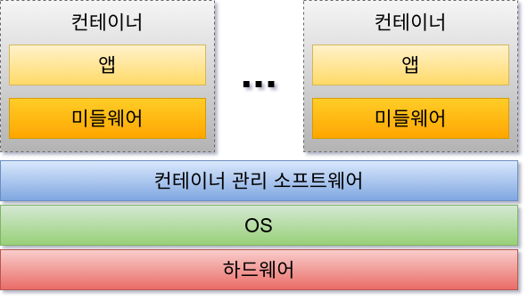
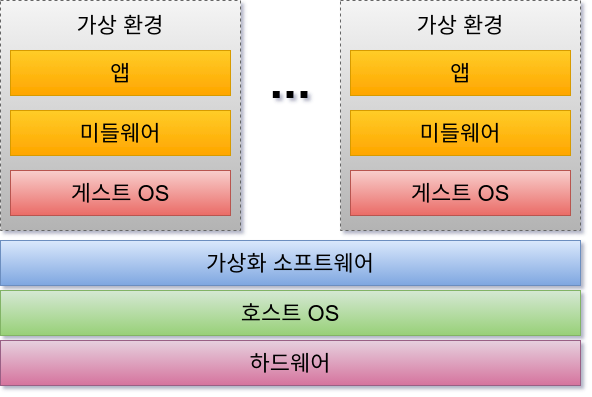
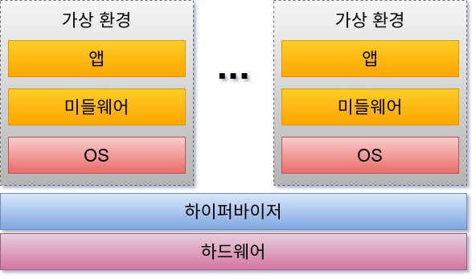

# 01-3. 컨테이너와 서버 가상화 기술

컨테이너란 호스트 OS상에 논리적인 구획(컨테이너)을 만들고, 애플리케이션을 작동시키기 위해 필요한 라이브러리나 애플리케이션 등을 하나로 모아, 
마치 별도의 서버인 것처럼 사용할 수 있게 만든 것이다. 호스트 OS의 리소스를 논리적으로 분리시키고, 여러 개의 컨테이너가 공유하여 사용한다. 
컨테이너는 오버헤드가 적기 때문에 가볍고 고속으로 작동한다는 것이 특징이다.

> 오버헤드란?
> > 가상화를 수행하기 위해 필요한 CPU 자원, 디스크 용량, 메모리 사용량 등을 말한다.

도커는 아래와 같은 구조를 사용하고 있다.

보통 물리 서버 상에 설치한 호스트 OS의 경우 하나의 OS 상에서 움직이는 여러 애플리케이션은 똑같은 시스템 리소스를 사용한다. 이때 작동하는 여러 애플리케이션은 
데이터를 저장하는 디렉토리를 공유하고, 서버에 설정된 동일한 IP 주소로 통신을 한다. 그래서 여러 애플리케이션에서 사용하고 있는 미들웨어나 라이브러리의 
버전이 다른 경우에는 각 애플리케이션이 서로 영향을 받지 않도록 주의해야 한다.

이에 반해 컨테이너 기술을 사용하면 OS나 디렉토리, IP 주소 등과 같은 시스템 자원을 마치 각 애플리케이션이 점유하고 있는 것처럼 보이게 할 수 있다.

컨테이너는 애플리케이션의 실행에 필요한 모듈을 컨테이너로 모을 수 있기 때문에 여러 개의 컨테이너를 조합하여 하나의 애플리케이션을 구축하는 마이크로 
서비스형 애플리케이션과 친화성이 높은 것이 특징이다.

## 서버 가상화 기술들

클라이언트 PC에서 개발 환경 구축이나 클라우드의 가상 머신 서비스 등에서 널리 사용되는 서버 가상화 기술에는 몇 가지 방식이 있다.

### 호스트형 서버 가상화

호스트형 서버 가상화는 하드웨어 상에 베이스가 되는 호스트 OS를 설치하고, 호스트 OS에 가상화 소프트웨어 상에서 게스트 OS를 작동시키는 기술을 말한다.

가상화 소프트웨어를 설치하여 간편하게 가상 환경을 구축할 수 있기 때문에 개발 환경 구축 등에 주로 사용한다. Oracle이 제공하는 'Oracle VM VirtualBox'나 
'Vmware의 'VMware Workstation Player' 등이 있다.

하지만 이 방식은 컨테이너와는 다르게 호스트 OS 상에서 다른 게스트 OS를 움직이고 있기 때문에 오버헤드가 커진다. 즉, 간편하게 도입할 수 있지만 사양이 
낮은 컴퓨터의 경우 속도가 현저히 느려진다.

### 하이퍼바이저형 서버 가상화

하드웨어 상에 가상화를 전문으로 수행하는 소프트웨어인 '하이퍼바이저'를 배치하고, 하드웨어와 가상환경을 제어한다. 대표적인 것으로는 Microsoft Windows 
Server의 'Hyper-V' 나 Citrix사의 'XenServer' 등이 있다.

호스트 OS 없이 하드웨어를 직접 제어하기 때문에 자원을 효율적으로 사용할 수 있다. 단, 가상 환경마다 별도의 OS가 작동하므로 가상 환경의 시작에 걸리는 
오버헤드가 커진다. 하이퍼바이저형은 펌웨어로서 구축하는 경우가 많으며, 제품이나 기술에 따라 다양한 방법이 있다.

> 하이퍼바이저형은 클라우드의 가상 머신에서도 사용하는 방법이다.

---

+ #### [Windows의 Hyper-V 소개](https://learn.microsoft.com/ko-kr/virtualization/hyper-v-on-windows/about)
+ #### [XenServer](https://docs.xenserver.com/ko-kr/citrix-hypervisor)

컨테이너 기술과 서버 가상화 기술은 매우 비슷하지만 목적이 다르다. 컨테이너 기술은 애플리케이션의 실행 환경을 모음으로써 이식성을 높이고 확장성이 좋은 
환경에서 작동하는 것을 지향하고 있는 반면, 가상화 기술의 대부분은 서로 다른 환경을 어떻게 효율적으로 에뮬레이트할지라는 점을 지향하고 있다.

[목록으로...](../index.md)
