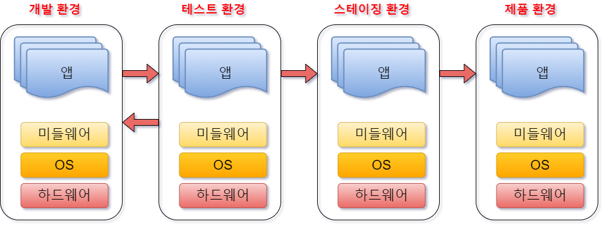
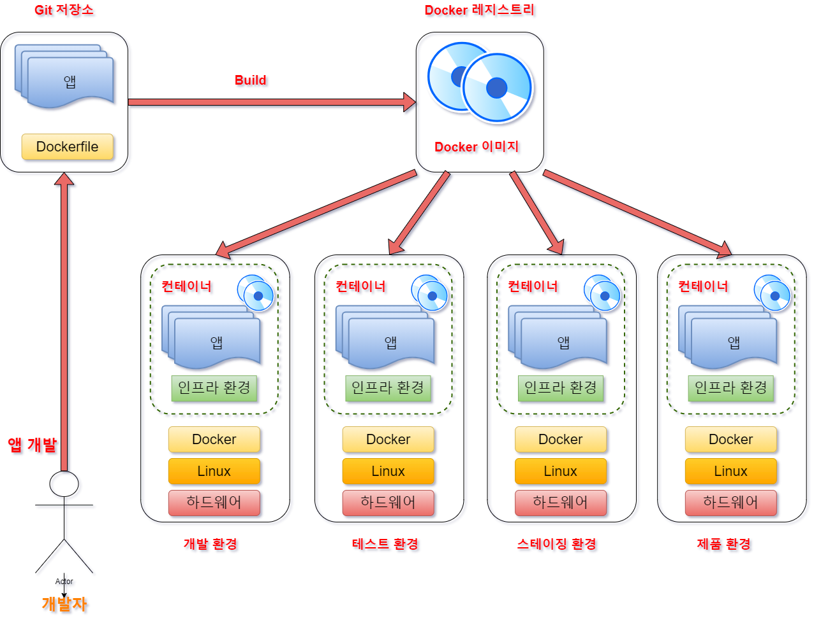
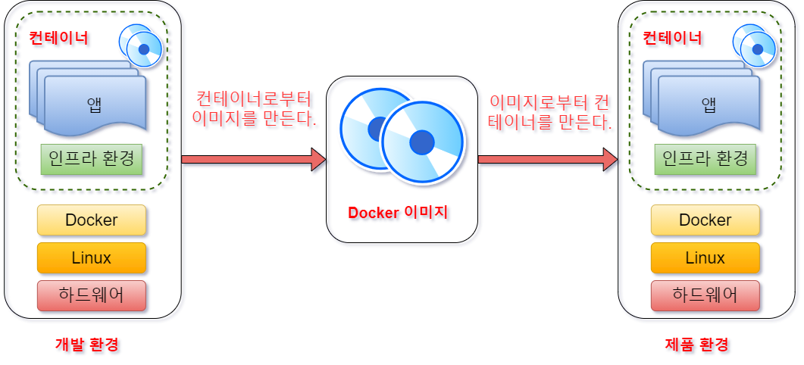
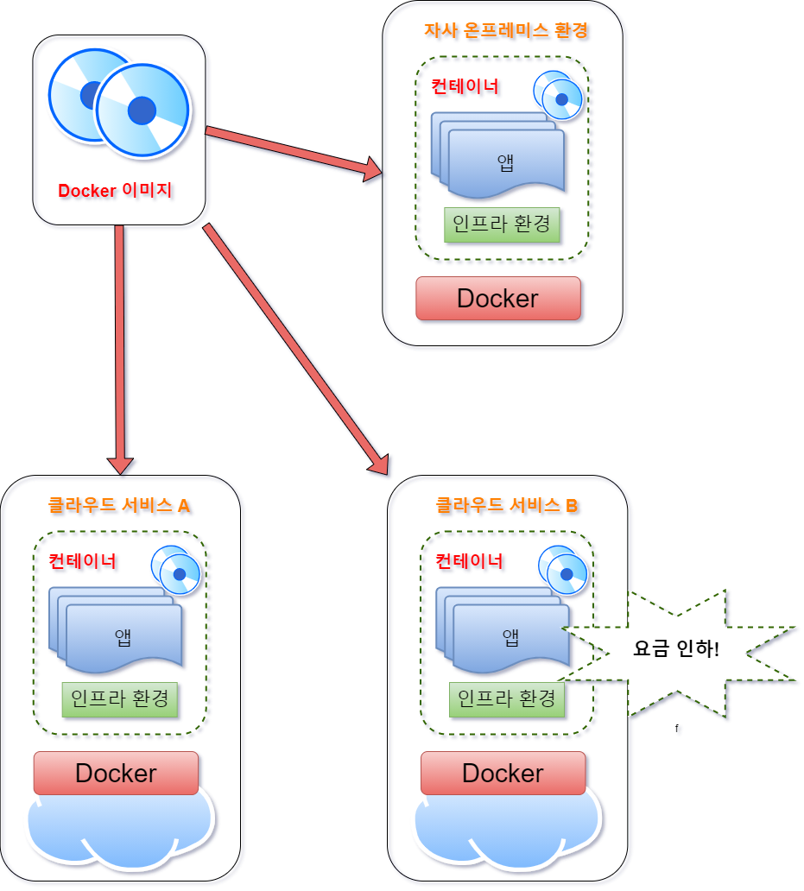

# 01-4. 프로그래머와 Docker

웹 시스템 개발 시 애플리케이션을 제품 환경에서 가동시키기 위해서는 다음과 같은 요소가 필요하다.

+ 애플리케이션의 실행 모듈 (프로그램 본체)
+ 미들웨어나 라이브러리군
+ OS/네트워크 등과 같은 인프라 환경 설정

폭포형 개발로 애플리케이션을 개발할 때는 위의 그림과 같은 흐름으로 개발을 진행한다. 개발 환경이나 테스트 환경에서는 올바르게 작동해도 스테이징 환경에서나 
제품 환경으로 전개하면 정상적으로 작동하지 않는 경우도 있다. 스테이징 환경이란 지속적 딜리버리가 일어나는 시스템 개발에서 개발한 애플리케이션을 제품 
환경에 전개하기 직전에 확인하는 테스트 환경을 말한다.

Docker에서는 이러한 인프라 환경을 컨테이너로 관리한다. 애플리케이션의 실행에 필요한 모든 파일 및 디렉토리들을 컨테이너로서 모아버리는 것이다. 
이러한 컨테이너의 바탕이 되는 Docker 이미지를 Docker Hub와 같은 Repository에서 공유한다.

Docker를 사용하면 아래와 같은 흐름으로 애플리케이션을 개발할 수 있다.

프로그래머는 Docker를 사용하여 개발한 애플리케이션의 실행에 필요한 모든 것이 포함되어 있는 Docker 이미지를 작성한다.

> 참고로, 개발 환경에서는 필요한 라이브러리가 제품 환경에서는 불필요한 경우가 있다.

이 이미지는 컨테이너의 바탕이 된다. 그리고 이렇게 작성된 이미지를 바탕으로 컨테이너를 가동시킨다. 이 이미지는 Docker가 설치되어 있는 환경이라면 
기본적으로 어디서든지 작동되므로 '개발/테스트 환경에서는 움직이지만 제품 환경에서는 움직이지 않는다' 는 리스크를 줄일 수 있다.

그리고 애플리케이션 개발부터 테스트 제품 환경에 대한 전개를 모두 애플리케이션 엔지니어가 수행하는 것이 가능해진다. 이로써 지속적 딜리버리를 가능하게 하고, 
변화에 강한 시스템을 구축할 수 있다.

> docker 이미지만 있으면, 어디서든지 움직인다.

또한 과학기술계산과 같은 분야에서는 단시간에 대량의 컴퓨터 리소스를 사용하고, 다양한 라이브러리를 사용한다. 이러한 실행 환경의 구축이나 라이브러리의 
버전 관리에 힘이 들면 본래 주력해야 할 솔버 개발 등에 집중할 수 없다. 이런 경우 해석에 필요한 모든 환경을 Docker 이미지로 모아두면 로컬 PC나 
클라이언트와 같이 다른 환경에서도 작동하는 실행 환경을 만들 수 있다.

## 애플리케이션의 이식성 (portability)

한 번 만들면 어디서든지 움직이는 소프트웨어의 특성을 이식성(portability) 이라고 한다. Docker는 이식성이 높기 때문에 클라우드 시스템과의 친화력도 
높은 것이 특징이다. Docker 컨테이너의 바탕이 되는 Docker 이미지만 있으면 애플리케이션을 동일한 환경에서 가동시킬 수 있다.

즉, 개발한 업무 애플리케이션을 온프레미스 환경에 대한 이전뿐만 아니라 "온프레미스 환경 -> 클라우드 환경 -> 온프레미스" 간에도 시스템 요건이나 예산에 
따라 손쉽게 실행 환경을 선택할 수 있다.

클라우드의 IaaS 서비스는 시스템이 이용한 리소스(CPU/GPU/메모리/디스크 용량)에 따라 요금이 정해진다. 클라우드 업체의 경쟁으로 이용료가 인하되는 
경우도 많으며, 시스템 예산에 따라 클라우드 서비스를 바꾸는 경우도 애플리케이션의 수정을 최소한으로 하여 옮길 수 있다.

시스템 개발에서는 애플리케이션의 실행 환경에 제약이 많으면 특정 업체에 의존하는 스시템이 되어버리거나 개발 속도가 떨어지는 경우가 있다. 실제로 기존의 
온프레미스 환경에서 작동하는 업무 시스템중에는 이러한 인프라에 얽매여, 필요 이상으로 복잡한 구성으로 시스템을 운용할 수밖에 없는 상황에 빠지거나, 
비지니스 속도를 따라갈 수 없는 업무 시스템이 되어버리는 경우도 많다.

그러한 시스템은 '고사'해버릴 가능성이 높으며, 기업은 스시템 유지보수 비용을 계속 부담하면서도 최종 사용자는 시스템 도입에 의한 혜택을 누리기 힘든 
상황에 처하게 된다.