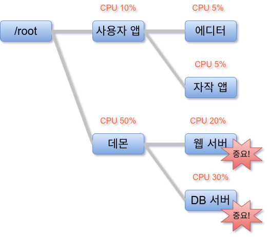
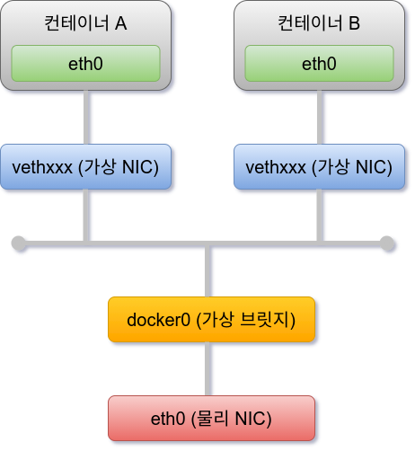
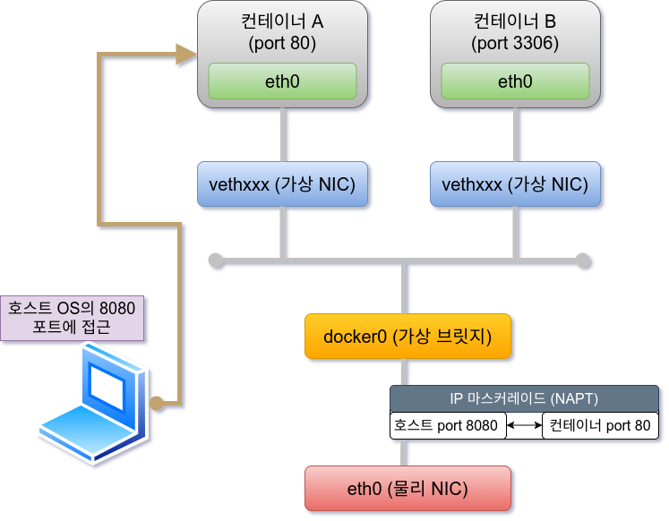
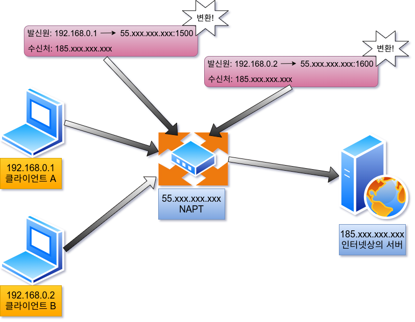

# 01-6. 릴리즈 관리 장치(cgroups) & 네트워크 구성(가상 브릿지/가상 NIC)

## 릴리즈 관리 장치(cgroups)

Docker에서는 물리 머신 상의 자원을 여러 컨테이너가 공유하며 작동한다. 이때 Linux 커널의 기능인 'control groups(cgroups)' 기능을 사용하여 
자원의 할당 등을 관리한다.

Linux에서는 프로그램을 프로세스로서 실행한다. 프로세스는 하나 이상의 스레드 모음으로 움직인다. cgroups는 프로세스와 스레드를 그룹화하여, 
그 그룹 안에 존재하는 프로세스와 스레드에 대한 관리를 수행하기 위한 기능이다. 예를 들어 호스트 OS의 CPU나 메로리와 같은 자원에 대해 그룹별로 제한을 
둘 수 있다. cgroups로 컨테이너 안의 프로세스에 대해 자원을 제한함으로써 예를 들면 어떤 컨테이너가 호스트 OS의 자원을 모두 사용해 버려서 동일한 
호스트 OS 상에서 가동되는 다른 컨테이너에 영향을 주는 일을 막을 수 있다.

cgroups로 관리할 수 있는 주요한 일은 다음과 같다.

|   항목    |         설명         |
|:-------|:------------------|
|   cpu   |     cpu 사용량 제한     |
| cpuacct |  cpu 사용량 통계 정보 제공  |
| cpuset  |   cpu나 메모리 배치 제어   |
| memory  |  메모리나 swap 사용량 제어  |
| devices | 디바이스에 대한 액세스 허가/거부 |
| freezer | 그룹에 속한 프로세스 정지/재개  |
| net_cls |   네트워크 제어 태그 부가    |
|  blkio  |  블록 디바이스 입출력량 제어   |

cgroups는 계층 구조를 사용하여 프로세스를 그룹화하여 관리할 수 있다. 예를 들어 사용자 애플리케이션과 서버와 같은 데몬 프로세스를 나눠, 각각의 그룹에 
CPU 사용량을 할당할 수 있다. cgroups의 부모 자식 관계에서는 자식이 부모의 제한을 물려받는다. 예를 들어 자식이 부모의 제한을 초과하는 설정을 하더라도 
부모 cgroups의 제한에 걸린다.

> 자식은 부모 그룹의 제한을 초과하여 할당할 수 없으므로 중요한 프로세스라도 영향을 받지 않는다.

## 네트워크 구성(가상 브릿지/가상 NIC)

Linux는 Docker를 설치하면 서버의 물리 NIC가 docker0 이라는 가상 브릿지 네트워크로 연결된다. 이 docker0 은 Docker를 실행시킨 후에 디폴트로 
만들어진다. Docker 컨테이너가 실행되면 컨테이너에 172.17.0.0/16이라는 서브넷 마스크를 가진 프라이빗 IP 주소가 eth0으로 자동으로 할당된다. 
이 가상 NIC는 OSI 참조 모델의 레이어 2인 가상 네트워크 인터페이스로, 페어인 NIC와 터널링 통신을 한다.

> 가상 NIC (vethxxx)는 컨테이너에서는 eth0으로 보인다.

Docker 컨테이너와 외부 네트워크가 통신을 할 때는 가상 브릿지 docker0과 호스트 OS의 물리 NIC에서 패킷을 전송하는 장치가 필요하다. Docker에서는 
NAPT 기능을 사용하여 연결한다.

### NAPT (Network Address Port Translation) 란?

하나의 IP 주소를 여러 컴퓨터가 공유하는 기술로, IP 주소와 port 번호를 변환하는 기능이다. 프라이빗 IP 주소와 글로벌 IP 주소를 투과적으로 상호 
변환하는 기술로, TCP/IP의 포트 번호까지 동적으로 변환하기 때문에 하나의 글로벌 IP 주소로 여러 대의 머신이 동시에 연결할 수 있다. 
Docker에서는 NAPT에 Linux의 iptables를 사용하고 있다.

Docker에서 이 기능을 사용할 때는 컨테이너 시작 시에 컨테이너 안에서 사용하고 있는 포트를 가상 브릿지인 docker0에 대해 개방한다. 예를 들어 
컨테이너 시작 시에 컨테이너 안의 웹 서버가 사용하는 80번 포트를 호스트 OS의 8080번 포트로 전송하도록 설정한다. 그러면 외부 네트워크에서 호스트 
OS의 8080번 포트에 액세스하면 컨테이너 안의 80번 포트로 연결된다.

### NAT 와 NAPT (IP mascarade) 의 차이

프라이빗 IP주소와 글로벌 IP주소를 변환하여 프라이빗 IP 주소가 할당된 컴퓨터에 대해 인터넷 액세스를 가능하게 할 때 사용하는 기술로는 NAT와 NAPT 
(IP 마스커레이드)가 있다.

### NAT (Network Address Translation)

프라이빗 IP 주소가 할당된 클라이언트가 인터넷상에 있는 서버에 액세스할 때 NAT 라우터는 클라이언트의 프라이빗 IP 주소 (예: 192.168.0.1) 를 NAT가 
갖고 있는 글로벌 IP 주소 (예: 55.xxx.xxx.xxx) 로 변환하여 요청을 송신한다. 응답은 NAT 라우터가 송신처를 클라이언트의 프라이빗 IP 주소로 변환하여 
송신한다.   
이러한 주소 변환에 의해 프라이빗 네트워크 상의 컴퓨터와 인터넷상의 서버 간의 통신이 성립된다. 그런데 NAT의 경우 글로벌 IP 주소와 프라이빗 IP 주소를 
1:1로 변환하기 때문에 동시에 여러 클라이언트가 액세스할 수가 없다.

> NAT는 프라이빗 IP주소와 글로벌 IP주소를 1:1로 변환한다.

### NAPT (Network Address Port Translation)

NAPT는 프라이빗 IP 주소와 함께 포트 번호도 같이 변환하는 기술이다. 프라이빗 IP 주소를 글로벌 IP 주소로 변환할 때 프라이빗 IP 주소별로 서로 다른 
포트 번호로 변환한다.

예를 들어 클라이언트 A가 보낸 요청은 포트 번호가 1500이고, 클라이언트 B가 보내온 요청은 포트 번호 1600이라고 해보자. 인터넷상의 서버로부터 NAPT의 
글로벌 IP 주소의 서로 다른 포트 번호 앞으로 응답이 되돌아 온다. NAPT는 포트 번호를 바탕으로 프라이빗 IP 주소로 변환할 수 있다. 이로써 하나의 글로벌 
IP 주소와 여러 개의 프라이빗 IP 주소를 변환할 수 있는 것이다.

> NAPT는 프라이빗 IP주소와 글로벌 IP주소뿐만 아니라 포트 번호도 변환한다.

또한 NAPT는 이러한 기술의 이름으로, Linux에서 NAPT를 구축하는 것을 IP 마스커레이드라고 부른다. 마스커레이드(mascarade)란 영어로 '가면무도회'를 
의미힌다. 이것은 많은 가면을 쓴 IP 패킷이 포트 번호의 가면을 붙여 변환되는 모습을 나타낸 것이다.
