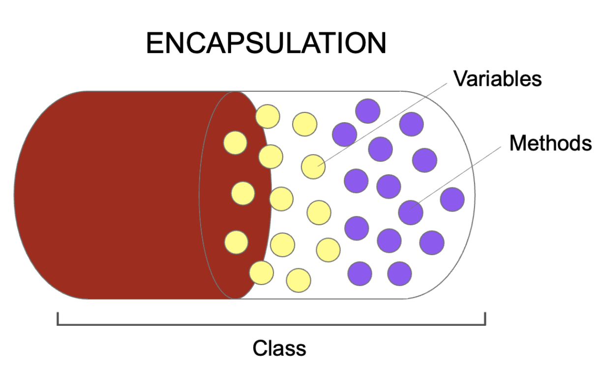

# 정보은닉(Information Hiding) & 캡슐화(Encapsulation)

캡슐화는 객체지향 패러다임 중 하나로, 중요한 데이터를 보존하고 보호하는 것이다. 일반적으로 연관 있는 변수와 함수를 클래스로 묶는
것을 뜻한다.  
반면, 은닉화는 객체에서 속성을 직접 접근하지 못하게 숨기는 것이다.

```python
class People:
    def __init__(self):
        # 멤버변수를 private로 선언 해줌과 동시에 은닉화
        self.__name: str = ''
        self.__age: int = 0

    # 캡슐화 발생하지 않음.
    def get_name(self) -> str:
        return self.__name
    
    def set_name(self, name: str) -> None:
        self.__name = name

    def get_age(self) -> int:
        return self.__age

    def set_age(self, age: int) -> None:
        self.__age = age
```

위의 코드에서 볼 수 있듯이, 멤버 변수를 선언해 중요한 데이터를 바로 접근하지 못하도록 사용하더라도 이름과 나이를 가져오는 메서드인
getter와 setter에서 메서드명에 변수 이름을 노출시키고 있기에 완벽한 캡슐화를 이루지 못한다.

_캡슐화가 적용되기 위해서는 객체를 만들고 객체 안에서 메서드를 구현할 때 이름을 추상적으로 명명해야 한다. 먼저 본인이 이 메서드를 왜
사용해야 하는지를 먼저 생각하고, 내가 가져와야 하는 이유를 명명하면 된다._

이를테면, 성인 콘텐츠와 미성년자 콘텐츠를 구분할 때, 은닉화되어 있는 나이의 getter를 가져와야 하는 이유로 명명하면 "get_age" 대신
"check_adult" 와 같이 추상적으로 명명할 수 있다. 이렇게 메서드 이름을 명명하면 외부에서 이 메서드를 사용하는 사용자는 '성인 여부를
확인하는 메서드구나' 라고 생각하고 사용하게 된다. 그렇게 된다면 이 안에서 어떤 속성을 사용했는지 내부 로직을 예측할 수 없게 된다.
__이렇게 사용자가 기능만 알고 사용하게 된다면 캡슐화는 잘 적용된 것이다.__

---

캡슐화 (Encapsulation)

캡슐화란 간단하게 말하면 변수 및 메서드들을 캡슐로 감싸서 안보이게 하는 정보 은닉 개념 중 하나이다.
예를 들어, 알약을 생각해보자.   
알약의 실제 약 내용은 가루약이지만, 이것을 캡슐로 감싸면서 쓴 맛을 은낙하여 사람이 먹기 편하게 하였으며 또한 복잡한 재료들의
배합을 캡슐로 포장하여 다루기 편하게 하였다.

<center></center>       

이처럼 캡슐화는 객체의 속성과 기능을 하나로 묶고, 외부로 부터 내부를 감싸 은닉한다. 또한 외부의 잘못된 접근으로 값이 변하는
의도치 않는 동작을 방지하는 _보호 효과_ 도 누를 수 있다.

```python
class Time:
    def __init__(self):
        # hour는 외부에서 접근하지 못하도록 private하게 선언한다.
        self.__hour: int

    @property
    def hour(self):
        return self.__hour

    @hour.setter
    def hour(self, hour):
        # hour에 대한 유효성 검사
        if hour < 0 or hour > 24:
            return
        self.__hour = hour


t = Time()
t.hour = 25     # error

t.hour = 12     # ok

print(t.hour)
```

위의 코드는 시간을 메서드로 입력받고, 출력하는 아주 간단한 캡슐화 예제이다. 여기서 클래스의 hour 멤버변수는 private으로 선언함으로써
다른 클래스에서의 접근을 제한해 두었다.   
그리고 이 private hour 변수를 다루기 위해서는 setter와 getter의 호출을 통해서만 가능하다.   
특히 이러한 메서드로 통한 접근 기법의 좋은 점은 유효성 검사이다. 메서드 내부에서 유효성 체크 로직을 통해 안전하게 데이터를
보존할 수 있다.

---

# 정보 은닉

정보 은닉을 구체적으로 말하면, 객체지향 언어적 요소를 활용하여 객체에 대한 구체적인 정보를 노출시키지 않도록 하는 기법을 칭한다.   

우리는 자동차를 몰 때 엔진이 어떻게 구동되어 바퀴가 굴러가는지 지식 필요없이 페달만 밟으면 자동차가 나아간다.   
이것이 자동차 원리 설계 정보를 은닉함으로서 경쟁사로부터 제품 내부를 알지 못하게 보안하는 효과도 있지만, 소비자가 페달만 밟으면
작동하도록 단순화 한 것도 포함한다. 이는 추상화 개념도 연결되는 대목이기도 하다.
