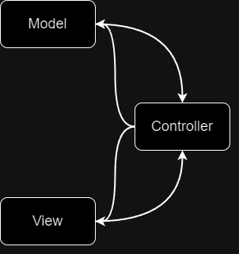

# Model View 아키텍처

Qt는 복잡한 애플리케이션을 구축하기 시작하면 위젯을 데이터와 동기화 상태로 유지하는 데 문제가 발생할 수 있다.

위젯에 저장된 데이터는 파이썬에서 조작하기 쉽지 않다. 변경하려면 항목을 가져와서 데이터를 얻은 다음 다시 설정해야 한다. 
이에 대한 기본 솔루션은 파이썬에서 외부 데이터 표현을 유지한 다음 데이터와 위젯 모두에 대한 업데이트를 복제하거나 데이터에서 전체 위젯을
다시 작성하는 것이다. 더 큰 데이터로 작업하기 시작하면 이 접근 방식이 애플리케이션의 성능에 영향을 미치기 시작할 수 있다.

Qt에는 이에 대한 솔루션인 Model-Views가 있다. Model-Views는 표준화된 모델 인터페이스를 사용해 간단한 데이터 구조에서 외부 
데이터베이스에 이르기까지 데이터 소스와 상호작용하는 표준 디스플레이 위젯에 대한 강력한 대안이다. 이를 통해 데이터가 분리된다.
즉, 원하는 구조로 데이터를 유지할 수 있으며 뷰는 프리젠테이션과 업데이트를 처리한다.

## 모델 뷰 아키텍처: 모델 뷰 컨트롤러

MVC(Model-View-Contoller)는 GUI 개발에 사용되는 아키텍처 패턴이다. 애플리케이션을 상호 연결된 세 부분으로 나눠 데이터의
내부 표현을 사용자에게 표시하고 사용자로부터 받아들이는 방식으로 분리한다.

MVC 패턴은 인터페이스를 다음 구성 요소로 나눈다.

+ Model      : 앱이 작업하는 데이터 구조를 가진다.
+ View       : 그래픽이든 테이블이든 사용자에게 표시되는 정보의 표현이다. 동일한 데이터에 여러 뷰가 허용된다.
+ Controller : 사용자의 입력을 받아 명령으로 변환하고 이를 모델이나 뷰에 적용한다.

Qt에서는 뷰와 컨트롤러의 구분이 약간 모호해진다. Qt는 OS를 통해 사용자로부터 입력 이벤트를 수락하고 이를 처리할 위젯에 위임한다.
그러나 위젯은 사용자에게 자신의 상태를 표시하는 것도 처리해 뷰에 바로 배치한다. 선을 그릴 위치에 대해 고민하는 대신 Qt에서 뷰와 
컨트롤러는 함께 병합돼 Model/View/Controller 아키텍처를 만든다.

위의 그림은 MVC 모델과 Qt 모델/뷰 아키텍처의 비교 그림이다.

---

## Model View

모델은 데이터 저장소와 ViewController 간의 인터페이스 역할을 한다. 모델은 데이터를 저장하고 뷰를 사용해 사용자에게 제공하는
표준화된 API를 통해 이 데이터를 제공한다. 다중 뷰는 완전히 다른 방식으로 동일한 데이터를 공유할 수 있다.

예를 들어 표준 파이썬 리스트, 딕셔너리 또는 데이터베이스를 포함해 모델에 '데이터 저장소'를 사용할 수 있다. 이는 전적으로 사용자에게
달려 있다.

두 부분은 본질적으로 다음을 담당한다.

1. 모델은 데이터나 이에 대한 참조를 저장하고 개별 또는 레코드 범위 및 관련 메타데이터 또는 표시 지침을 반환한다.
2. 뷰는 모델에서 데이터를 요청하고 위젯에 반환된 내용을 표시한다.

