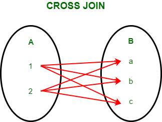

# 25-4. JOIN (INNER, OUTER, CROSS, SELF)

## <center></center>

`JOIN`은 `SELECT`명령어 만큼이나 자주 사용한다. 두 개 이상의 테이블을 하나의 테이블로 결합해서 가져올 때 사용한다.

## INNER JOIN (내부 조인)

`INNER JOIN`은 조인 중 가장 많이 사용된다. 그래서 보통 JOIN을 이야기할 때는 `INNER JOIN`을 말하는 것이다.

```sql
SELECT <field1, field2, ...> FROM <table>
    INNER JOIN <ref table> 
        ON <join condition>
    [WHERE <condition>]
```

> JOIN은 두 개 이상의 테이블을 결합하기때문에 동일한 필드 이름을 가지고 있다면 충돌이 발생하여 에러가 난다. 
> 
> __따라서 JOIN을 사용할때는 `테이블명.필드명` 이러한 형식으로 불러와야 안전하다.__

## OUTER JOIN (외부 조인)

> OUTER 키워드는 생략 가능

`INNER JOIN`은 양쪽 테이블 모두 내용이 있는 경우에만 결과가 검색되고, `OUTER JOIN`은 한쪽 테이블에만 내용이 있어도 결과가 검색된다. 자주
사용되지는 않지만 가끔 유용하게 사용되는 방식이다.

```sql
SELECT <field1, field2, ...> FROM <첫 번째 테이블(LEFT)>
    <LEFT | RIGHT | FULL> [OUTER] JOIN <두 번째 테이블(RIGHT)>
    ON <join condition>
[WHERE <condition>]
```

`OUTER JOIN`은 기준 테이블 내용의 누락 없이 검색하면서도, 대상 테이블의 내용을 가져올 수 있다. 두 가지 테이블의 내용을 한 번에 가져올 수도 있다.

+ __LEFT__
  + `OUTER JOIN` 앞에 `LEFT`를 쓰면, 첫 번째 테이블의 내용은 두 번째 테이블과 연계되는 내용이 없더라도 모두 검색되어야 한다는 뜻.
  + `OUTER JOIN` 앞에 `RIGHT`를 쓰면, 두 번째 테이블의 내용은 모두 검색되어야 한다는 뜻.
  + `OUTER JOIN` 앞에 `FULL`을 쓰면, 모든 테이블의 내용이 모두 검색되어야 한다는 뜻.

## CROSS JOIN (상호 조인)

## <center></center>

> `CROSS JOIN`은 한쪽 테이블의 행 하나당 다른 쪽 테이블의 모든 행을 하나씩 모든 행들을 각각 조인한다.

즉, A테이블 하나의 행을 B테이블의 모든 행들에 조인한다 (1:N). `CROSS JOIN`의 결과 행의 개수는 `A테이블 행의 개수 X B테이블 행의 개수`가 된다.
그래서 `CROSS JOIN`은 `카티션 곱(Catesian Product)`이라고도 부른다.

다음은 `CROSS JOIN`의 기본 문법이다. `INNER JOIN`과 `OUTER JOIN`과는 다르게 `ON`구문은 사용하지 않는다.

```sql
SELECT * FROM a_table CROSS JOIN b_table;
```

## SELF JOIN (자체 조인)

`SELF JOIN`은 자기 자신에게 조인하는 것이다. 같은 테이블에 두 번 참조해야 하는 경우 사용한다.

셀프 조인은 자기 자신과 조인하므로 1개의 테이블을 사용한다. 별도의 문법이 있는 것은 아니며 1개로 조인하면 자체 조인이 된다.

```sql
SELECT <field1, field2, ...> FROM <table> AS A
  INNER JOIN <table> AS B
  [WHERE 검색 조건];
```
