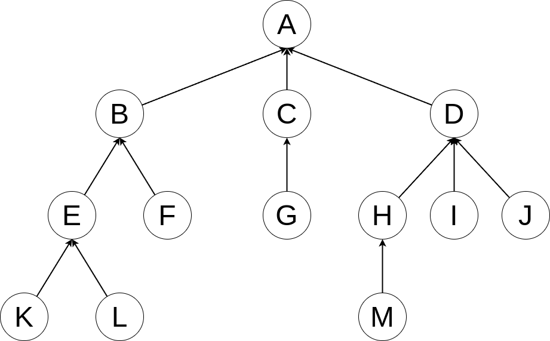
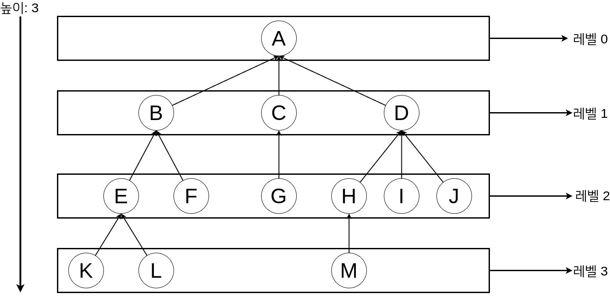
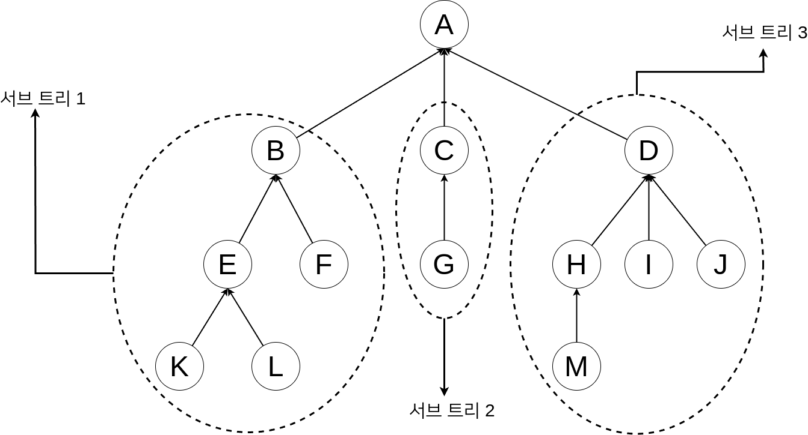
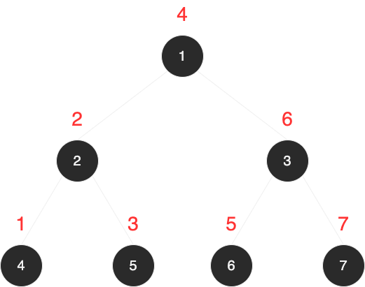

# 29-6. 트리(Tree)

## 트리 구조(Tree Structure)

트리 구조는 주변 일상 생활에서 쉽게 찾아 볼 수 있는 구조이다. 한 가족의 계보를 나타내는 족보나 회사의 조직도, 집 주소 등을 보면
트리 주소 형태로 되어 있다. 족보의 경우 가장 선조가 되는 분부터 시작해서 줄줄이 이어지는 후손으로 형태가 되어 있다. 이 족보를 도형으로
표현하면 트리 구조가 된다.

마찬가지로 회사의 조직도 역시 사장부터 시작해서 사장 밑에 여러 명의 이사, 그 이사들 밑에 각 부서의 부서장 그리고 부서장 밑에 과장 그리고 대리
이렇게 내려오면 결국 사원까지 오게 된다.

이와 같은 일상 생활의 개념적인 트리 구조를 컴퓨터에서 사용하게 된 것이다.

다음은 전형적인 트리의 구조이다.




트리 구조는 노드와 그 노드들을 연결하는 링크로 구성되어 있다. 가장 상위에 있는 노드를 `루트(root)`라고 한다. 또한 자신의 노드보다 상위에 있는
노드를 `부모 노드(Parent Node)`라고 하며, 자신의 노드 보다 아래에 있는 노드를 `자식 노드(Child Node)`라고 한다.

트리 구조에서 최상위 노드를 `루트 노드(Root Node)`라고 하듯이, 최하위 노드를 `리프 노드(Leaf Node)`라고 한다.

또한 같은 보무 노드를 갖는 노드들의 사이를 `형제 노드(Sibling Node)`라고 한다.

트리 구조는 `레벨(Level)`과 `높이(Height)`가 존재한다. 레벨은 루트 노드부터 해당 노드까지 경로를 찾아 오는데 방문한 총 노드의 수가 된다.
위의 그림에서 노드 G의 레벨은 2, 노드 M의 레벨은 3이 된다. 트리의 높이는 트리 구조 내에서 가장 큰 레벨을 그 트리 구조의 높이라고 말한다.
다음의 그림과 같은 경우 트리의 높이는 3이 된다.



트리 구조에서 보면 알 수 있듯이 자식 노드는 몇 개라도 상관없지만, 부모 노드는 반드시 하나만 존재해야 한다. __부모 노드가 2개 이상 존재하면
그 구조는 트리 구조가 될 수 없다.__

+ 트리에는 루트 노드(Root Node)가 반드시 존재한다.
+ 루트 노드를 제외한 나머지 노드들은 여러 개의 노드들의 그룹으로 나뉠 수 있으며 그 노드 그룹 역시 하나의 트리가 된다.

## 트리의 용어

### 차수

한 노드에 연결된 서브 트리의 개수를 `차수`라고 한다. 다음의 그림에서 노드 A의 차수는 노드 A에 연결된 서브 트리가 모두 3개이므로 3이 되며
노드 D의 차수는 노드 D에 연결된 노드가 3개이므로 3이 된다.

이 중에서 차수가 2개 이하의 트리 구조를 특별히 `이진 트리(Binary Tree)`라고 하며 일반적으로 많이 사용하는 트리 구조이다.



트리의 가장 끝에 있는 노드를 `단말 노드`, `터미널 노드` 혹은 `리프 노드`라고 한다. 위의 그림에서 리프 노드는 노드 K, L, F, G, M, I, J가 된다.

## 이진 트리 (Binary Tree)

여러 가지 트리 중에서 `이진 트리(Binary Tree)`는 __자식 노드를 2개 이하만 갖는 트리이다.__

즉, 트리의 차수(Degree)가 2개 이하인 트리를 의미한다. 최대 2개만의 자식 노드를 갖는 트리 구조이기 때문에 이 트리 구조의 이름은 `이진 트리`이다.

이진 트리는 자식 노드가 2개만 존재하기 때문에 구현이 간단하다는 장점이 있다. 이진 트리는 형성된 형태에 따라 몇 가지 종류가 있다. 


```python
class TreeNode:
    def __init__(self):
        self.__data = None
        self.__left = None
        self.__right = None

    def __del__(self):
        print('TreeNode of {} is deleted'.format(self.data))

    @property
    def data(self):
        return self.__data

    @data.setter
    def data(self, data):
        self.__data = data

    @property
    def left(self):
        return self.__left

    @left.setter
    def left(self, left):
        self.__left = left

    @property
    def right(self):
        return self.__right

    @right.setter
    def right(self, right):
        self.__right = right


class BinaryTree:
    def __init__(self):
        self.root = None

    # root 노드 반환
    def get_root(self):
        return self.root

    # root 노드 설정
    def set_root(self, r):
        self.root = r

    # 새로운 노드를 만들어 반환
    def make_node(self):
        new_node = TreeNode()
        return new_node

    # 노드의 데이터 반환
    def get_node_data(self, cur):
        return cur.data()

    # 노드의 데이터 설정
    def set_node_data(self, cur, data):
        cur.data = data

    # 왼쪽 서브 트리 반환
    def get_left_sub_tree(self, cur):
        return cur.left

    # 오른쪽 서브 트리 반환
    def get_right_sub_tree(self, cur):
        return cur.right

    # 왼쪽 서브 트리 만듦
    def make_left_sub_tree(self, cur, left):
        cur.left = left

    # 오른족 서브 트리 만듦
    def make_right_sub_tree(self, cur, right):
        cur.right = right


if __name__ == '__main__':
    # 이진 트리 객체 생성
    bt = BinaryTree()

    # 노드 생성
    n1 = bt.make_node()
    bt.set_node_data(n1, 1)

    n2 = bt.make_node()
    bt.set_node_data(n2, 2)

    n3 = bt.make_node()
    bt.set_node_data(n3, 3)

    n4 = bt.make_node()
    bt.set_node_data(n4, 4)

    n5 = bt.make_node()
    bt.set_node_data(n5, 5)

    n6 = bt.make_node()
    bt.set_node_data(n6, 6)

    n7 = bt.make_node()
    bt.set_node_data(n7, 7)

    # 노드 1을 root 노드로 설정
    bt.set_root(n1)

    # root 노드의 왼쪽 자식 노드로 노드2 설정
    bt.make_left_sub_tree(n1, n2)
    # root 노드의 오른족 자식 노드로 노드3 설정
    bt.make_right_sub_tree(n1, n3)
    bt.make_left_sub_tree(n2, n4)
    bt.make_right_sub_tree(n2, n5)
    bt.make_left_sub_tree(n3, n6)
    bt.make_right_sub_tree(n3, n7)
```

위의 코드를 실행하면 다음과 같은 이진 트리가 구성된다.


## 트리의 순회

트리의 모든 노드를 중복하지 않으면서 방문하는 것을 순회(traversal)이라고 한다. 데이터를 저장만 하고 찾을 수 없다면 아무 소용이 없다. 
그만큼 순회는 굉장히 중요한 개념이다.   

순회하는 방법에는 세 가지가 있다.

> 전위 순회(preorder traversal)
>> root -> 왼쪽 서브 트리 -> 오른쪽 서브 트리
 
> 중위 순회(inorder traversal)
>> 왼쪽 서브 트리 -> root -> 오른쪽 서브 트리

> 후위 순회(postorder traversal)
>> 왼쪽 서브 트리 -> 오른쪽 서브 트리 -> root

전위 순회든 중위 순회든 후위 순회든 왼쪽 서브 트리와 오른쪽 서브 트리가 들어 있다. 목적은 모든 노드를 방문하는 것으므로 서브 트리의 
모든 노드도 방문해야 한다.   
방문하는 방법은 재귀를 통해 모든 노드를 방문할 수 있다. 서브 트리도 이진 트리이므로 서브 트리에서도 순회마다 순서를 맞춰 재귀적으로 
노드를 방문하는 것이다.   

이진 트리를 어떻게 순회하는지 다음 그림으로 살펴보자.

### 전위 순회 (preorder traverse)


### 중위 순회 (inorder traverse)



### 후위 순회 (postorder traverse)


---

__재귀 함수를 이용하여 각 순회를 구현해 보자__

```python
class TreeNode:
    def __init__(self):
        self.__data = None
        self.__left = None
        self.__right = None

    def __del__(self):
        pass

    @property
    def data(self):
        return self.__data

    @data.setter
    def data(self, data):
        self.__data = data

    @property
    def left(self):
        return self.__left

    @left.setter
    def left(self, left):
        self.__left = left

    @property
    def right(self):
        return self.__right

    @right.setter
    def right(self, right):
        self.__right = right


class BinaryTree:
    def __init__(self):
        self.root = None

    # root 노드 반환
    def get_root(self):
        return self.root

    # root 노드 설정
    def set_root(self, r):
        self.root = r

    # 새로운 노드를 만들어 반환
    def make_node(self):
        new_node = TreeNode()
        return new_node

    # 노드의 데이터 반환
    def get_node_data(self, cur):
        return cur.data()

    # 노드의 데이터 설정
    def set_node_data(self, cur, data):
        cur.data = data

    # 왼쪽 서브 트리 반환
    def get_left_sub_tree(self, cur):
        return cur.left

    # 오른쪽 서브 트리 반환
    def get_right_sub_tree(self, cur):
        return cur.right

    # 왼쪽 서브 트리 만듦
    def make_left_sub_tree(self, cur, left):
        cur.left = left

    # 오른족 서브 트리 만듦
    def make_right_sub_tree(self, cur, right):
        cur.right = right

    # 전위 순회로 트리를 순회
    def preorder_traverse(self, cur, func):
        # 만약 방문한 노드가 빈 노드일 때
        if not cur:
            return

        # 먼저 방문 노드의 데이터를 인자로 함수 호출
        func(cur.data)
        # 왼쪽 서브 트리 순회
        self.preorder_traverse(cur.left, func)
        # 오른쪽 서브 트리 순회
        self.preorder_traverse(cur.right, func)

    # 중위 순회로 트리를 순회
    def inorder_traverse(self, cur, func):
        if not cur:
            return

        # 먼저 왼쪽 서브 트리 순회
        self.inorder_traverse(cur.left, func)
        # 왼쪽 서브 트리 모두 순회 후, 방문 노드의 데이터를 인자로 함수 호출
        func(cur.data)
        # 오른쪽 서브 트리 순회
        self.inorder_traverse(cur.right, func)

    # 후위 순회로 트리를 순회
    def postorder_traverse(self, cur, func):
        if not cur:
            return

        # 왼쪽 서브 트리 순회
        self.postorder_traverse(cur.left, func)
        # 오른쪽 서브 트리 순회
        self.postorder_traverse(cur.right, func)
        # 왼쪽 서브 트리와 오른쪽 서브 트리 모두 순회한 후
        # 마지막으로 방문 노드의 데이터를 인자로 함수 호출
        func(cur.data)


if __name__ == '__main__':
    # 이진 트리 객체 생성
    bt = BinaryTree()

    # 노드 생성
    n1 = bt.make_node()
    bt.set_node_data(n1, 1)

    n2 = bt.make_node()
    bt.set_node_data(n2, 2)

    n3 = bt.make_node()
    bt.set_node_data(n3, 3)

    n4 = bt.make_node()
    bt.set_node_data(n4, 4)

    n5 = bt.make_node()
    bt.set_node_data(n5, 5)

    n6 = bt.make_node()
    bt.set_node_data(n6, 6)

    n7 = bt.make_node()
    bt.set_node_data(n7, 7)

    # 노드 1을 root 노드로 설정
    bt.set_root(n1)

    # root 노드의 왼쪽 자식 노드로 노드2 설정
    bt.make_left_sub_tree(n1, n2)
    # root 노드의 오른족 자식 노드로 노드3 설정
    bt.make_right_sub_tree(n1, n3)
    bt.make_left_sub_tree(n2, n4)
    bt.make_right_sub_tree(n2, n5)
    bt.make_left_sub_tree(n3, n6)
    bt.make_right_sub_tree(n3, n7)

    # 방문 노드의 데이터를 출력하는 람다 함수
    f = lambda a: print(a, end=' ')

    # 전위 순회
    # 기대 출력 값: 1 2 4 5 3 6 7
    bt.preorder_traverse(bt.get_root(), f)
    print()

    # 중위 순회
    # 기대 출력 값: 4 2 5 1 6 3 7
    bt.inorder_traverse(bt.get_root(), f)
    print()

    # 후위 순회
    # 기대 출력 값: 4 5 2 6 7 3 1
    bt.postorder_traverse(bt.get_root(), f)
    print()


""" 결과

1 2 4 5 3 6 7 
4 2 5 1 6 3 7 
4 5 2 6 7 3 1 

"""
```

전위 순회, 중위 순회, 후위 순회 모두 재귀 함수를 통해 순회 순서를 구현한다. 탈출 조건은 빈 노드일 때이다.    
인자 func는 데이터 처리 함수로 방문 노드의 데이터를 인자로 받아 실행된다.   

재귀 함수는 분할 정복 알고리즘 등 여러 알고리즘을 구현하는 데 요긴하게 쓰인다.

트리는 삽입은 물론 탐색과 삭제도 빨라 프로그래밍에서 자주 사용되는 자료 구조이다.
